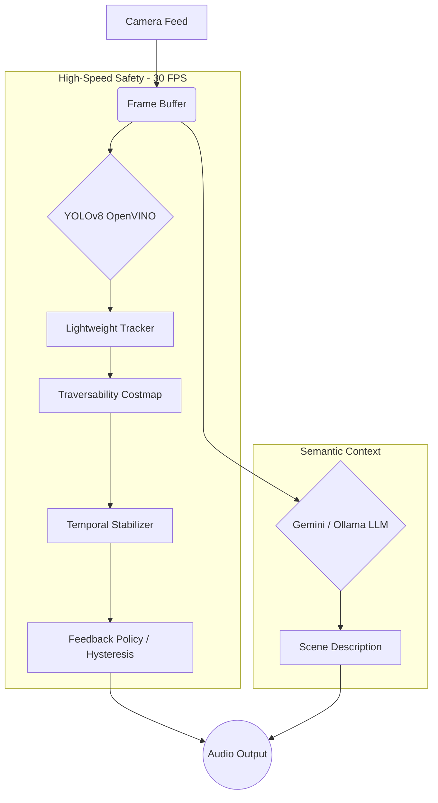

# Vision Assistant System

An advanced, hybrid edge-cloud vision assistant designed to provide real-time spatial navigation and high-level semantic context for visually impaired users.

## Core Academic Novelties

1. **Hybrid Edge-Cloud Architecture**: Decouples the localized, high-speed YOLOv8 pipeline running on edge hardware (for Time-to-Collision and safety) from a secondary, asynchronous LLM pipeline (Gemini/Ollama) for rich semantic understanding.
2. **Monocular Spatial Traversability**: Calculates a 16x12 2D occupancy grid dynamically from a single camera feed using geometric ground-plane assumptions, bypassing the need for LIDAR or stereo cameras.
3. **Temporal Stabilization & Hysteresis**: Fixes the "alert flickering" issue common in assistive tech by implementing a temporal hysteresis framework. This requires sustained frame-over-frame evidence to escalate commands and enforces a de-escalation hold, guaranteeing a smooth audio feedback loop.

## Architecture Pipeline



## Setup & Installation

1. Create a Python environment:
   ```bash
   python -m venv venv
   source venv/bin/activate  # Or venv\Scripts\activate on Windows
   ```

2. Install dependencies:
   ```bash
   pip install -r requirements.txt
   ```

3. Run the development server:
   ```bash
   python manage.py runserver 0.0.0.0:8000
   ```

## Evaluation

To evaluate the system's stability and generate ablation metrics (Latency, FPS, Command Flips):
```bash
python scripts/run_ablation_video.py <input_video.mp4> <output_directory>
```
The script will output a structured CSV for plotting.

## License

This project is licensed under the MIT License - see the LICENSE file for details.
